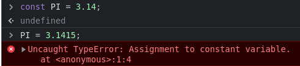
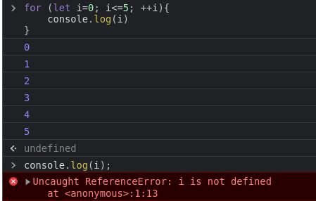
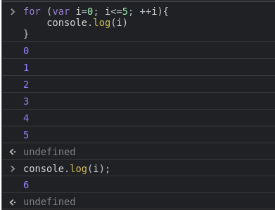

# 3: Explicar la diferencia entre var, let y const. Y dar un ejemplo en qué caso se utilizará

## `const ->` se debe utilizar cuando no quieres que el valor cambie durante la ejecucion del programa

### Por ejemplo

## `let ->` se debe utilizar cuando no quieres que su scope sea utlizado fuera del bloque de codigo donde se encuentra, si declaras una variables con `let` fuera de una funcion, no podras utilizar su valor

### Por ejemplo

### No puedo ver el valor de la variavle `i` fuera del bloque for porque fue declarada con `let`

## `var ->`  Es una variable que SI puede cambiar su valor y su scope es global o local ya que no importa en que bloque fue declarada

### Por ejemplo

### Con `var` si puedo ver el valor de `i` fuera del bloque for ya que el ambito de `var` es goblal o local

## la verdad casi no se usa `var`
