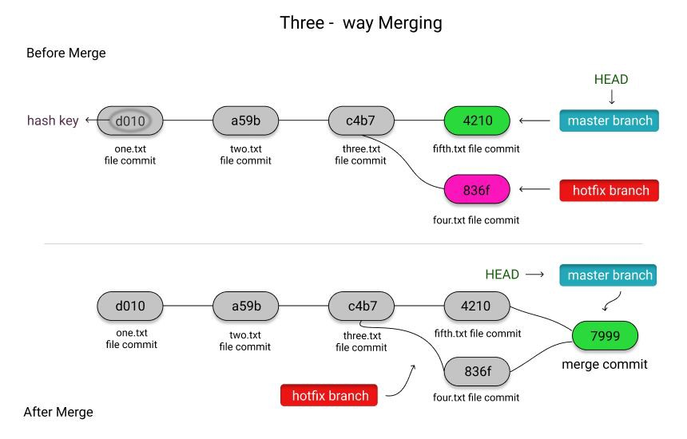
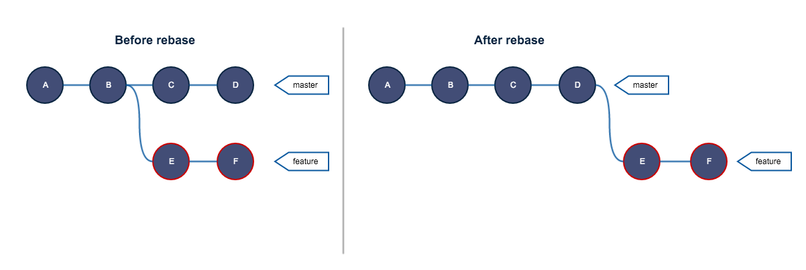

# 5: Explicar la diferencia entre git merge y git rebase.

consideremos que hay dos ramas, la rama principal y la rama secundaria. La `rama principal es el master` y la rama secundaria es donde se ejecutarán modificaciones

## `Git merge -> `

 1. git merge al ser aplicado, mantiene a salvo la historia de la rama secundaria, ya que crea un nuevo commit que une ambas ramas sin “eliminarlas”, creando un nuevo punto de continuación que tiene 2 historias por detrás.

## `Git rebase ->` 

 2. git rebase al ser aplicado, NO mantiene a salvo la historia de la rama secundaria, sino que “re-escribe” la historia de la rama principal integrando los commits de la rama secundaria en la rama principal, no crea un commit de unión adicional, sino que cambia el puntero (HEAD) al último commit que ubica.

