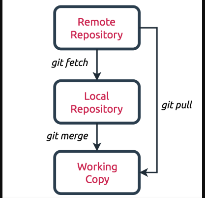

# 6: ¿Cuál es la diferencia entre Pull Request (PR) y el comando `git pull` ?

Mientras que `git pull` lo usamos para extraer y descargar contenido desde un repositorio remoto y actualizar al instante el repositorio local para reflejar ese contenido el `Pull Request (PR)` lo usamos para solicitar al propietario de un repositorio que incorpore nuestros feautures al codigo del repositorio remoto.

No sobra decir que `git pull` es la combinacion de dos comandos 
1. git fetch
2. git merge

